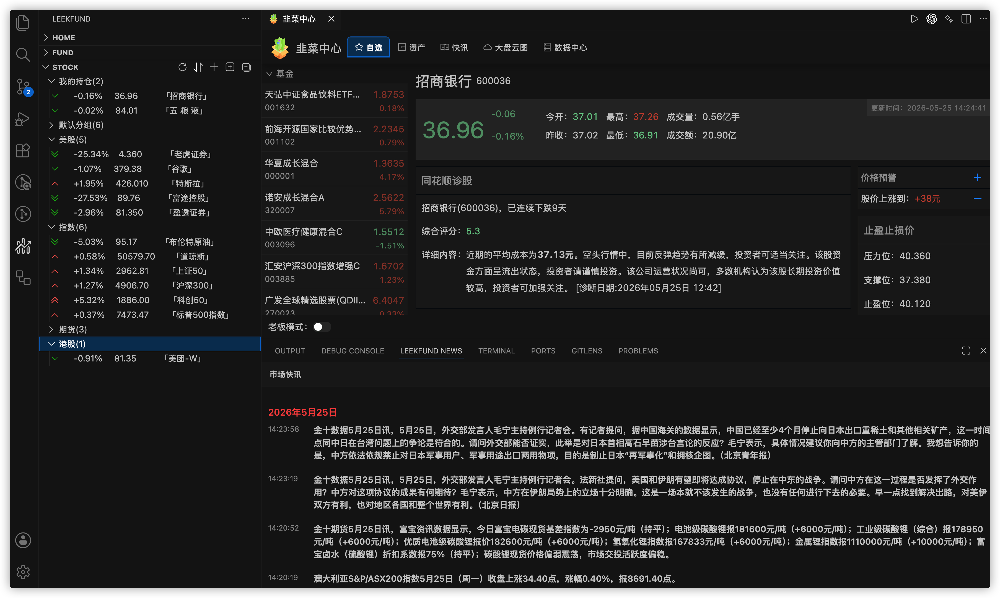
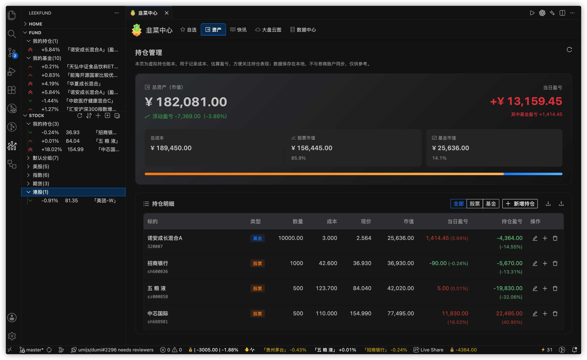
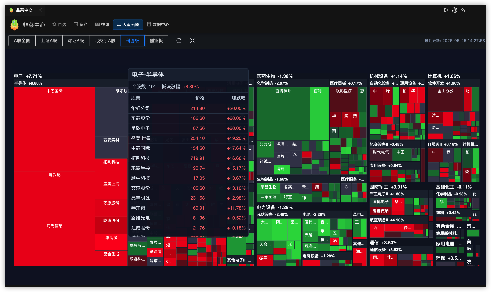
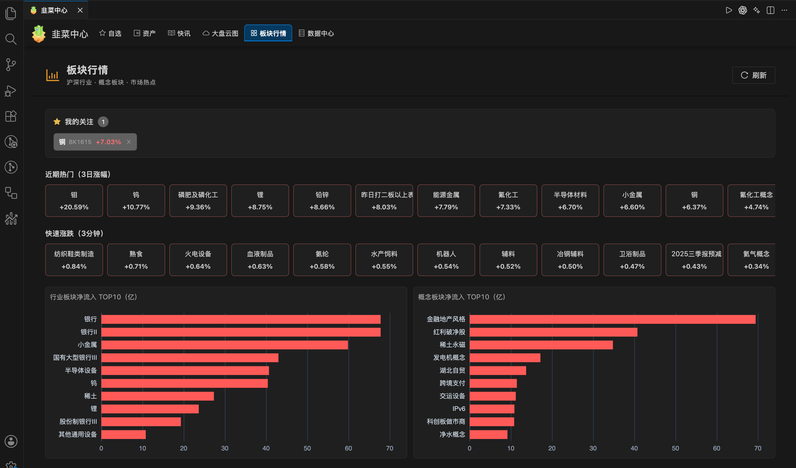
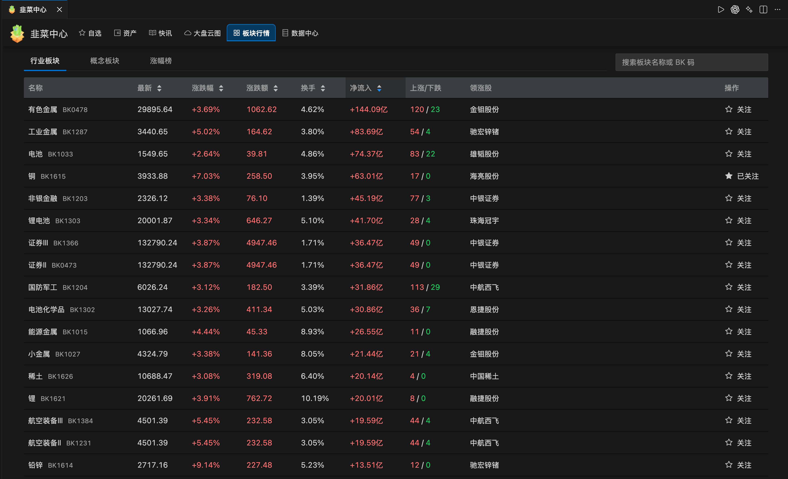
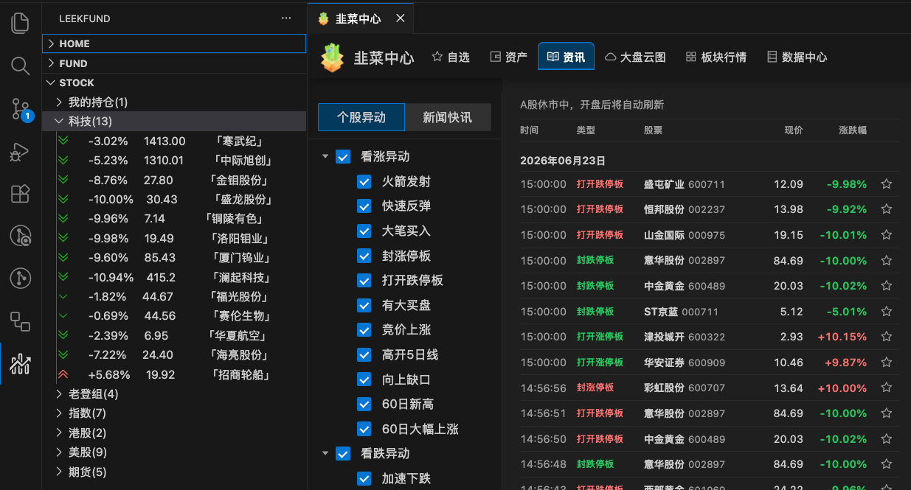
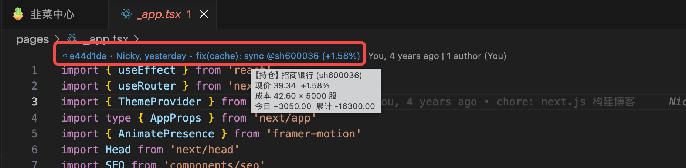
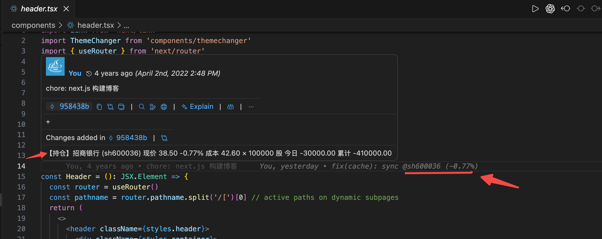
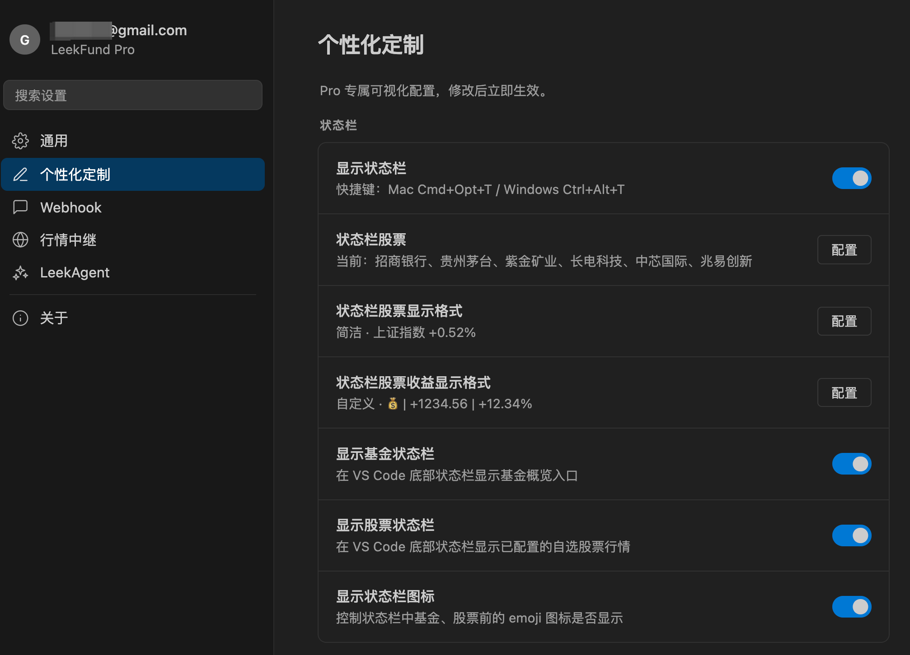
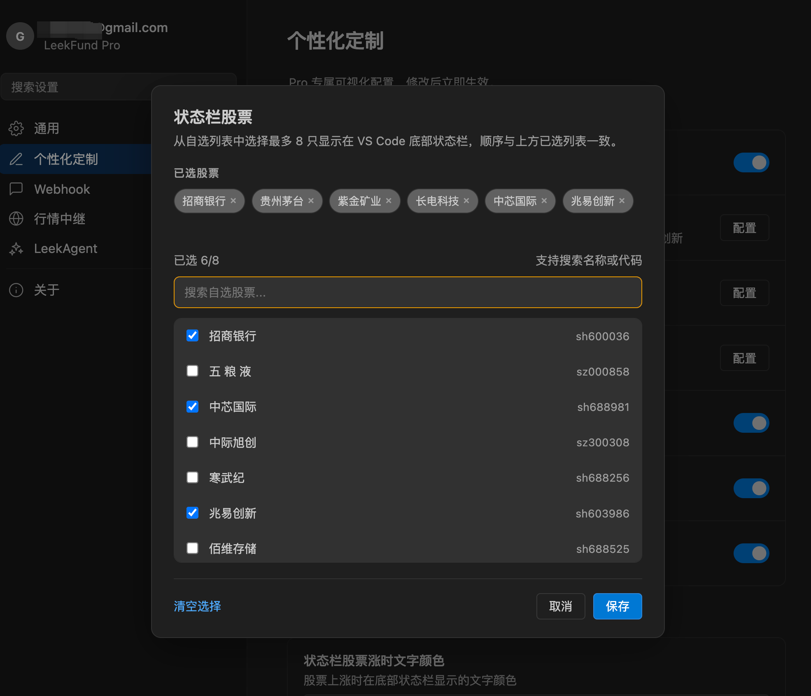

# LeekFund

网站：https://leek.fund/

兼容 VS Code 生态编辑器。在你用 AI 专注于写代码的同时，它在后台实时且隐蔽地追踪着市场，绝不打断你的任何工作流。

投资有风险，入市需谨慎！

**声明**：本软件仅为数据辅助展示工具，不提供任何投资建议。数据均来自公开网络渠道，因网络延迟或第三方引起的行情误差，本软件不承担法律责任。

## Table of contents

- [功能特性](#功能特性)
- [安装使用](#安装使用)
- [使用文档](#使用文档)

## 功能特性

### 基础功能

- 基金 / 股票 / 期货 / Binance 实时涨跌
- 支持 A 股、港股、美股、国内期货、海外基金、外汇牌价
- 状态栏行情概览
- 基金实时 / 历史走势图、基金排行榜、基金披露持仓信息
- 自定义涨跌颜色与涨跌图标
- 简单版本基金持仓金额、股票成本价维护设置
- 简单版本基金 / 股票盈亏展示
- 股票涨跌提醒配置（IDE 内通知）
- 韭菜中心：基金 / 股票详情、K 线、资金流向等

### LeekFund Pro

- **股票 / 基金自定义分组**：自定义分组、自动展示「我的持仓」分组、分组折叠、分组、个股拖拽排序
- **持仓管理中心（完整）**：总资产、浮动盈亏、编辑 / 加仓 / 删除、账本导入导出
- **市场快讯**：韭菜中心>快讯 + LeekFund News 面板
- **大盘云图**：韭菜中心>大盘云图
- **个性化定制面板**：高级自定义。状态栏股票自选、显示格式、股票收益格式等可视化配置
- **股价预警 Webhook 群推送**（企业微信 / 钉钉 / 飞书）
- **板块行情**：行业 / 概念列表、资金流向、涨幅榜与成分股详情，与大盘云图、自选联动。 [详细文档](https://leek.fund/docs/sector-boards)
- **行情中继**：Pro 用户可在自建服务器部署代理，将股票 / 基金行情请求转至个人中继，应对内网拦截证券 API 或高频监测； [详细文档](https://leek.fund/docs/market-data-relay)
- **LeekAgent**：进行快讯摘要、自选 / 持仓概览、标的公开信息解读。 [详细文档](https://leek.fund/docs/leek-agent)
- **编辑器 Blame 伪装**：在代码文件中以 Git 提交日志样式私密查看持仓股票行情

## 安装使用

安装插件：[Visual Studio Marketplace](https://marketplace.visualstudio.com/items?itemName=giscafer.leek-fund)

| 要求 | 版本 |
|------|------|
| VS Code | `^1.100.0` |
| Cursor | `^3.0.0` |

## 使用文档

- [在线功能介绍](https://leek.fund/docs/getting-started)
- [行情中继（Pro）](https://leek.fund/docs/market-data-relay)

<!-- https://raw.staticdn.net/ 为GitHub raw 加速地址 -->

### 资产管理

### 大盘云图

### 板块行情

### 个股异动

### Blame 伪装
编辑器 Blame 伪装，相比状态栏与侧边栏查看行情信息更加隐蔽

> 文件头部

> 文件git message。持仓多只股时，鼠标光标依次换行点击即可轮播查看不同持仓股

自定义配置在 **Settings** 视图下（Pro 用户可使用可视化个性化定制）：

## All Thanks To Our Contributors

## License

[LICENSE](./LICENSE)

