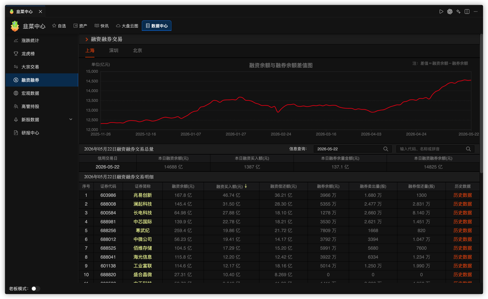

# LeekFund

网站：https://leek.fund/

**LeekFund**——极客、沉浸式、极简、无感摸鱼。全面兼容 VS Code 生态编辑器。在你用 AI 专注于写代码的同时，它在后台实时且隐蔽地追踪着市场，绝不打断你的任何工作流。

投资有风险，入市需谨慎！

## Table of contents

- [功能特性](#功能特性)
  - [免费版](#免费版)
  - [LeekFund Pro](#leekfund-pro)
- [订阅高级版](#leekfund-pro-订阅)
- [安装使用](#安装使用)
- [使用文档](#使用文档)
- [社区交流](#社区交流)
- [License](#license)

## 功能特性

LeekFund 分为 **免费版** 与 **LeekFund Pro** 两个版本（v4.0.0+开始支持Pro）。行情查看、基础自选与盈亏计算等核心能力永久免费；分组管理、资产管理中心、LeekAgent、市场快讯等进阶能力需订阅 Pro。

### 免费版

- 基金 / 股票 / 期货 / Binance 实时涨跌
- 支持 A 股、港股、美股、国内期货、海外基金、外汇牌价
- 状态栏行情概览
- 基金实时 / 历史走势图、基金排行榜、基金披露持仓信息
- 自定义涨跌颜色与涨跌图标
- 简单版本基金持仓金额、股票成本价维护设置
- 简单版本基金 / 股票盈亏展示
- 股票涨跌提醒配置（IDE 内通知）
- 韭菜中心：基金 / 股票详情、K 线、资金流向等

### LeekFund Pro

在免费版全部能力之上，额外解锁：

- **股票 / 基金自定义分组**：自定义分组、自动展示「我的持仓」分组、分组折叠、分组、个股拖拽排序
- **持仓管理中心（完整）**：总资产、浮动盈亏、编辑 / 加仓 / 删除、账本导入导出
- **市场快讯**：韭菜中心>快讯 + LeekFund News 面板
- **大盘云图**：韭菜中心>大盘云图
- **个性化定制面板**：高级自定义。状态栏股票自选、显示格式、股票收益格式等可视化配置
- **股价预警 Webhook 群推送**（企业微信 / 钉钉 / 飞书；免费版可填写地址但不会实际推送）
- **LeekAgent**：Chat 输入 `@leek` 或打开右侧 **LeekAgent** 面板，进行快讯摘要、自选 / 持仓概览、标的公开信息解读（不提供荐股或买卖建议，详见 [leekagent.md](leekagent.md)）
- **编辑器 Blame 伪装**：在代码文件中以 Git 提交日志样式私密查看持仓股票行情

## LeekFund Pro 订阅

1. 在 [leek.fund](https://leek.fund/) 注册并登录 > 订阅套餐
2. 在 VS Code 命令面板执行 **「登录 LeekFund Pro」**（`leek-fund.proLogin`），完成浏览器授权
3. 订阅套餐后执行 **「刷新 Pro 状态」**（`leek-fund.proRefresh`）即可激活

| 命令 | 说明 |
|------|------|
| `leek-fund.proLogin` | 登录 LeekFund Pro |
| `leek-fund.proLogout` | 登出 |

也可在 **Settings（设置面板）** 或 **Home** 视图中登录、升级与管理订阅。

## 安装使用

安装插件：[Visual Studio Marketplace](https://marketplace.visualstudio.com/items?itemName=giscafer.leek-fund)

| 要求 | 版本 |
|------|------|
| VS Code | `^1.100.0` |
| Cursor | `^3.0.0` |

## 使用文档

- [在线功能介绍](https://leek.fund/docs/getting-started)

<!-- https://raw.staticdn.net/ 为GitHub raw 加速地址 -->

编辑器 Blame 伪装，相比状态栏与侧边栏查看行情信息更加隐蔽

> 持仓多只股时，鼠标光标依次换行点击即可轮播查看不同持仓股

自定义配置在 **Settings** 视图下（Pro 用户可使用可视化个性化定制）：

## 社区交流

- 电报群：https://t.me/+P1p3nJoqKR45MzQ1

公众号：

## All Thanks To Our Contributors

<!-- ## Contributing

Please follow our [contributing guidelines](./.github/CONTRIBUTING.md).

**避免插件发布出现异常，贡献者请遵循**：

- 本地开发调试完成后，建议执行 `yarn package` 进行打包出 `leek-fund-xx.vsix` 文件
- VSCode 编辑器插件选择从 VSIX 安装，测试验证功能正常后再 push 代码提交 PR -->

## License

[LICENSE](./LICENSE)

---

- X [@nicky_lao](https://twitter.com/nicky_lao)
- Youtube [@LeekHuber](https://www.youtube.com/@LeekHuber)
