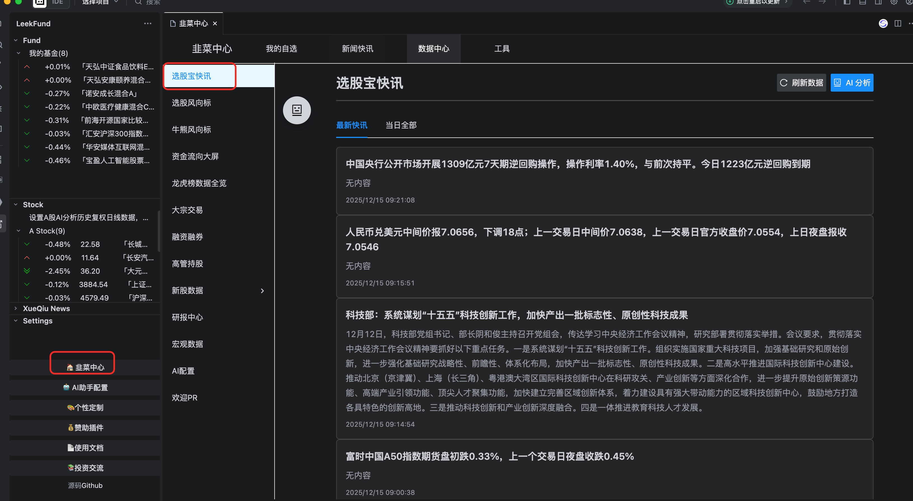
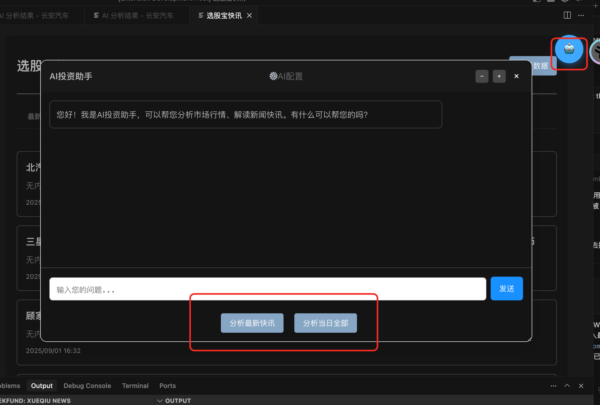
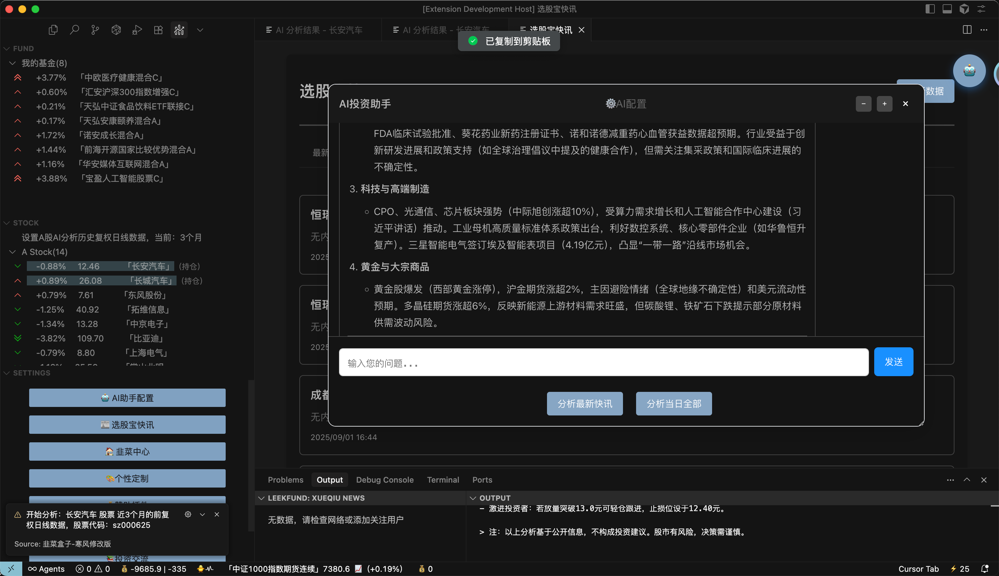
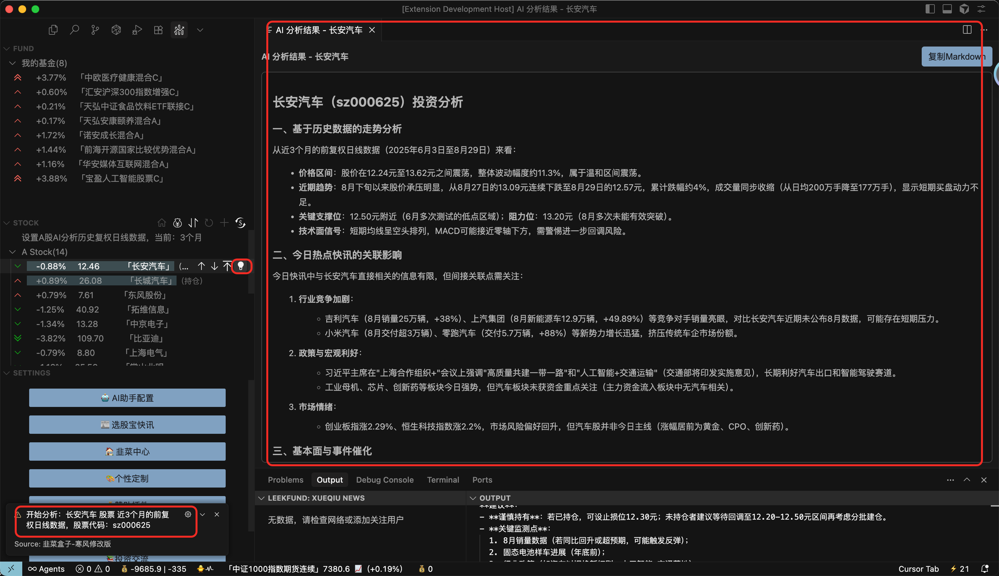
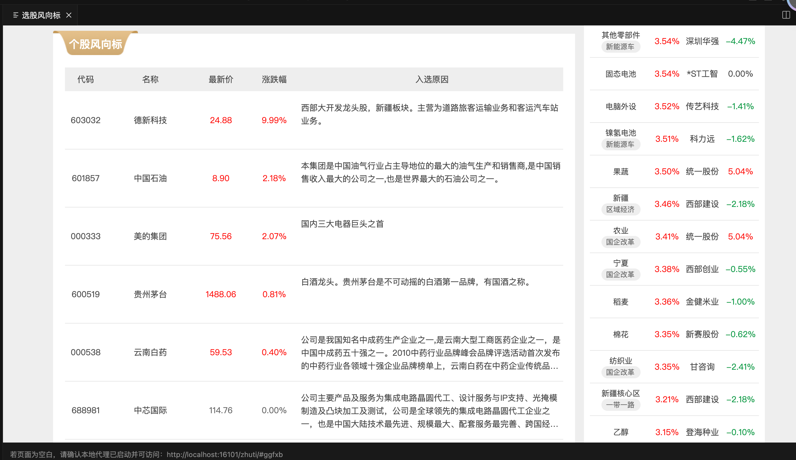
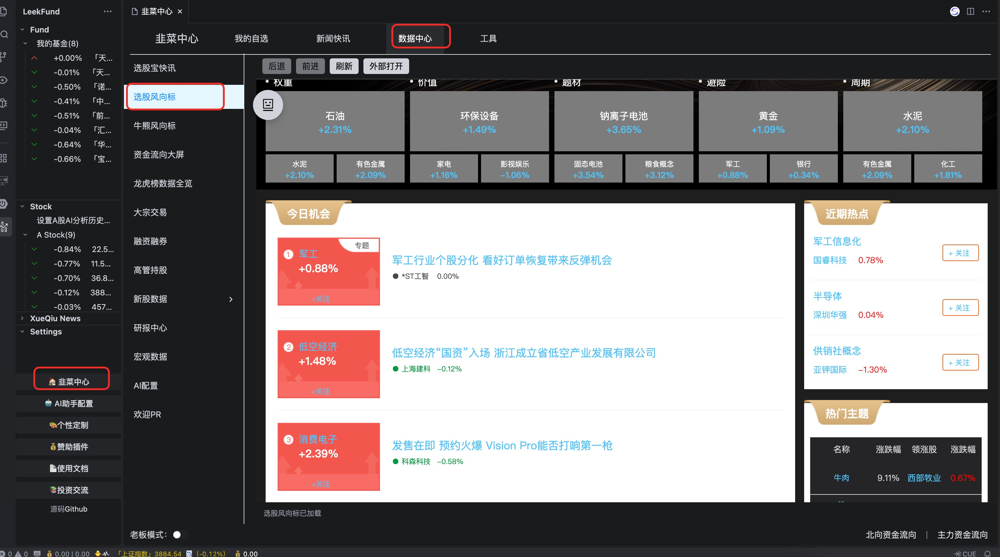
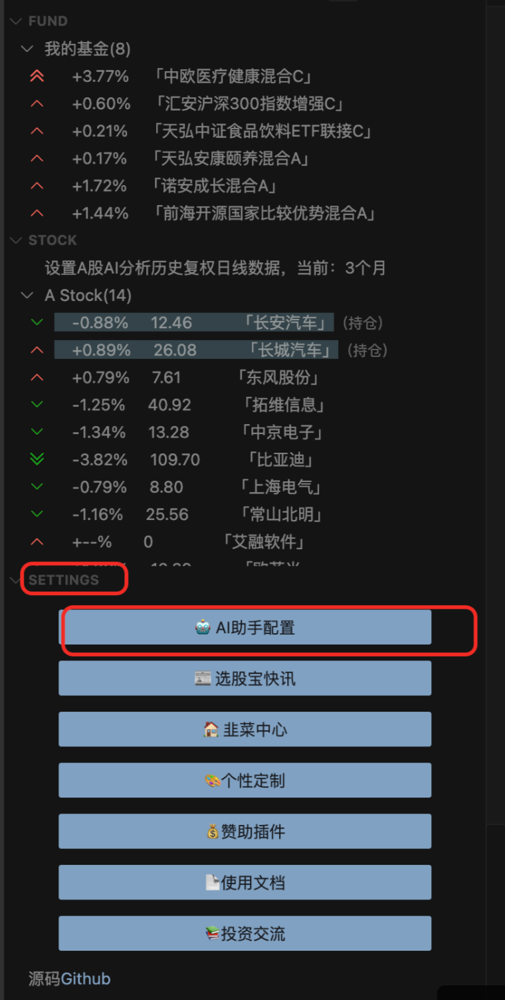

新增选股宝快讯功能、AI投资助手、指定股票AI分析功能（目前只针对A股），内置AI大模型助手功能，支持ai分析最新资讯、ai分析当日资讯（让ai随时给你分析股市信息）
1、新增选股快讯宝功能 
2、AI投资助手、AI助手本地配置
3、AI当日热点资讯分析功能
4、新增A股个股分析
5、A股个股分析集成韭研公社个股讨论信息
6、A股个股分析功能集成雪球热门资讯
7、新增选股风向标功能

借助大模型，快速解读选股宝快讯与当日资讯，提炼重点、研判情绪，辅助你更高效地获取市场关键信息。

- 功能概览
  - AI 分析最新资讯: 对最新快讯进行要点提炼、利空利多判断与潜在影响分析。
  - AI 分析当日资讯: 汇总当日重要资讯，给出市场脉络、风险提示与机会线索。
- 使用入口
  - 命令面板: 按下 Cmd+Shift+P（Windows/Linux 使用 Ctrl+Shift+P），输入并执行“选股宝快讯”。
选股快讯宝功能：

AI投资助手：

AI投资助手对当日资讯进行汇总分析：

对A股进行AI分析(当前只支持A股)：
提供历史交易数据、当前股票的论坛讨论情况、雪球热门资讯；目前是三种数据结合提供给AI进行数据分析  
对指定股票分析，点击股票后小灯泡

选股风向标功能（查看热门股票及板块）：

使用前AI配置：
settings中：AI助手配置功能

ai助手配置的key大家可以注册阿里的心流账号，每天有免费的额度：https://iflow.cn/